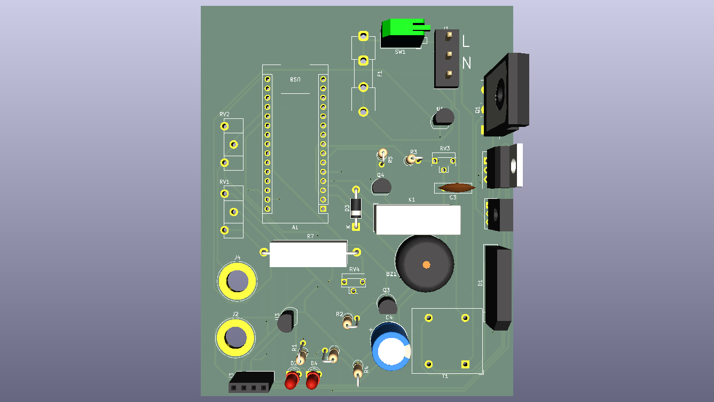

# Adjustable Voltage & Current Lab Power Supply

A clean and simple DIY lab power supply designed for easy assembly, affordable parts, and hands-on electronics learning.

## Preview

---

# Demo

##  - link to the PCB on KiCanvas
##  - link to the SCH on KiCanvas

# Features

- Adjustable voltage and current 30VDC 3A max;
- Power supply takes in 220VAC, steps down the voltage and rectifies;
- Efficiently regulates voltage and/or limits current;
- The smart system with a MCU regulates heat and prevents overheating;
- OLED Display and visual and acoustic warnings.

# DIY How to

1. Analyze the schematic and PCB design and determine if these fit your needs;

2. Gather all of the needed parts from the BOM;

3. A housing and heatsink aren't listed in the BOM so make sure you have one;

4. The setup is pretty straight forward tho the wiring of the LEDs, potentiometers and the OLED display may be difficult;

5. More to come later...

# How it works
 
## Disclaimer

The transformator was found in my dads garage so certain characteristics are unknown, I do reccomend finding a quality transformator from some older power supplies you can find in your local E-Waste center.

## General overview

This setup is pretty common and similar schematics for a linear power supply can be found on the internet, it is pretty simple and begginer friendly so I reccomend it to anyone who wants to get into electronics!

## Tech details
Now lets get to the core, the 220VAC which is standard for my region gets stepped down through the transformator to 24V or 33.84V PtP and then is rectified and goes through a 4700 uF polarized capacitor which filters noise, in parallel with the capacitor is an LED which indicates if there is current or no, later the connections are pretty self-explanatory and follow the schematic of the IC which is in my case the TL431.
### My contribution
I have added some of my spices to this by measuring the current and voltage as well as the temperature with the help of Arduino NANO, which is a small but more then enough for my use case, I also connected a relay which is driven by a BC547 NPN transistor, the relay is NO and is only closed while the temperature of the VRM and the exit transistor is under a certain threshold to protect the components. 
## Stable 5V for the MCU
I have also utilized the LM731 VRM so I can provide stable 5V to the Arduino, the setup for that one is also pretty straight forward following the data sheet.  
# Credits
Big shoutout to my father, without him, having patience and will to work is getting hard as I easily get annoyed but he gets me to enjoy this, also he's the main finder of other open source projects which I later work on and modify
## The idea for the Arduino voltage and current display
[Link to github repository of the inspo.](https://github.com/tehniq3/PS_reber)